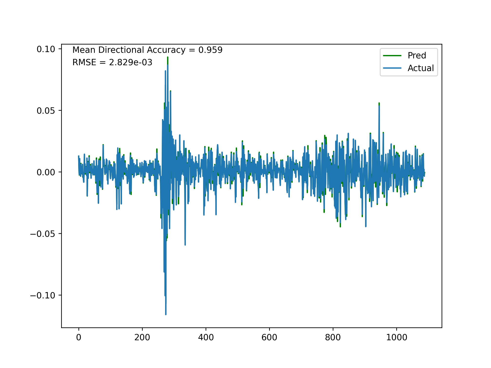
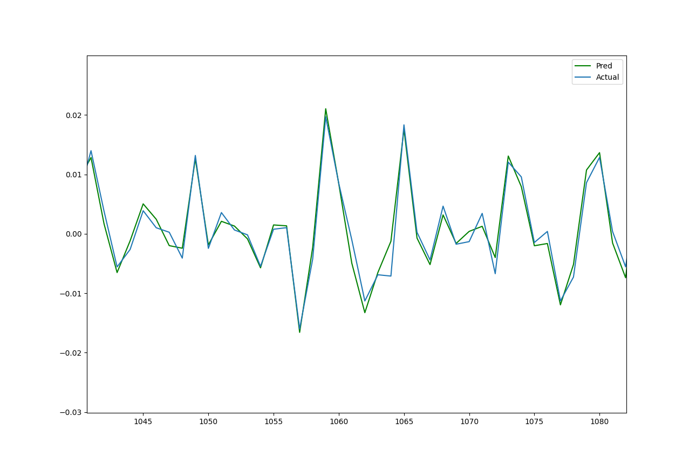

# MODWT-MARS
A hybrid model that combines maximal overlap discrete wavelet transform multiresolution analysis (MODWT-MRA) with the multivariate adaptive regression splines algorithm (MARS) to produce a one-step-ahead forecast.

This project is partially inspired from this paper by Jothimani, D., Shankar, R., Yadav, S.S.:
[Discrete Wavelet Transform Based Prediction of Stock Index: A Study on National Stock Exchange FiftyIndex](https://arxiv.org/ftp/arxiv/papers/1605/1605.07278.pdf) to explore/extend the general concept and evaluate their findings and methodolgy.

The premise of this framework is to decompose the close price or log-return of a stock using MODWT-MRA and use the resulting detail coefficients and smooth coefficient as inputs for the MARS model. The MARS algorithm is chosen here subjectively to compare to the papers use of SVR and ANN models.

MODWT allows for decomposition of nondyadic lengthed signals (not constrained to lengths that are multiples of $2^j$ where $j$ is the level of decomposition) and is circular-shift invariant (output is the same regardless of what time-step we start at) making it more suitable for real-world financial time series. It decomposes a signal in time-frequency space, exposing time-frequency information in the orignal signal not seen otherwise. The MODWT-MRA also circularly shifts the coefficients by the phase shift of the underlying wavelet filter to approximately align them in time with the original series, and generally produces a smoother decomposition than MODWT alone while providing additive reconstruction.

A level 3 MODWT-MRA, using a Daubechies least asymmetric wavelet of length 8, is performed in R using reflection at the right boundary* (See Methodological Flaws below). A feature set is generated autoregressively by taking the 4 previous values at each time step given by the expression below.

At time t, value x is defined as: 

$x(t) = f(x(t-1),x(t-2),x(t-3),x(t-4))$

This is done for the 3 detail coefficients $D1, D2, D3$ and the smooth coefficient $S3$.

Each coefficient is predicted separately using MARS and then AdaBoost. The predicted coeffcient vectors are then summed up afterwards to produce the final prediction vector since the MRA can additively reconstruct the original signal.

# Methodological Flaws
* It is a common problem amongst quantitative finance research papers to incorrectly apply wavelet transforms, and DSP generally, to financial data and use decompositions as features for model training. My model produces results that are significantly better than the mentioned paper's (Both RMSE (2.829e-03) and DA (95.9%) scores, as used in the paper) but it is misleading and unsusable in the real world. Both the DWT-MRA and MODWT-MRA are fundamentally noncausal methods: at any time t, in order to compute the coefficients the MRA uses data from $t-L+1$ to $t+L-1$ where $L$ is the filter length of the basis wavelet. In the case of this project the choice of the $la8$ wavelet would mean we are looking 7 time steps in the future. Because of the circular convolution in MRA, we also have boundary effected coefficients at both the start and end. The first $L_j - 1$ coefficients and the last $N-L_j+1$ coefficients (where $L_j = (2^j−1)(L−1) + 1$ and $j, L$ are the decomposition level and wavelet filter length respectively) are effected. Only the first $L_j - 1$ coefficients are effected in standard MODWT and Algorithme A Trous (AT), both of which are actually causal. In both cases, these boundary coefficients must be removed and in the case of MRA this makes forecasting impossible.

* Additionally, applying ML algorithms to each detail coefficient and smooth coefficient separately only compounds these errors in boundary coefficients once added back together. A more thorough and causal framework is required for accurate sequential forecasting.

# Packages

<table>
<tr>
<th>Python</th>
<th>R</th>
</tr>
<tr>
<td>
<pre>

- numpy
- pandas
- statsmodels
- pandas datareader
- datetime
- matplotlib
- scipy
- xgboost
- [py-earth](https://github.com/scikit-learn-contrib/py-earth)
- sklearn

</pre>
</td>
<td>

- waveslim
- ggplot2
- alphavantager

</td>
</tr>
</table>

# Plots
**Out of Sample Results** (MSE & MDA):

**Out of Sample Results** (Zoomed in):

